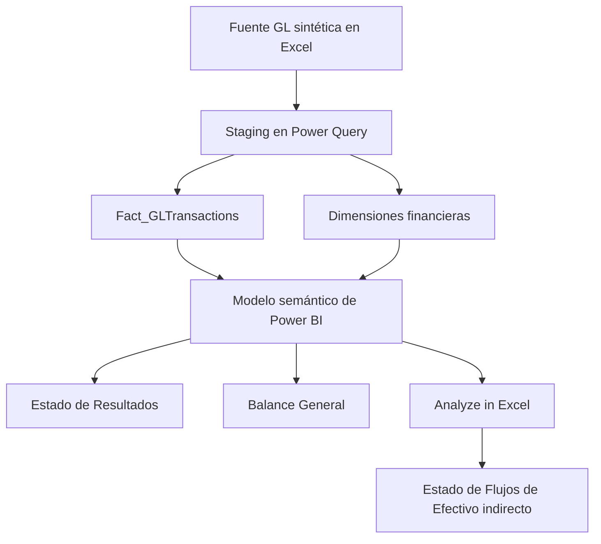
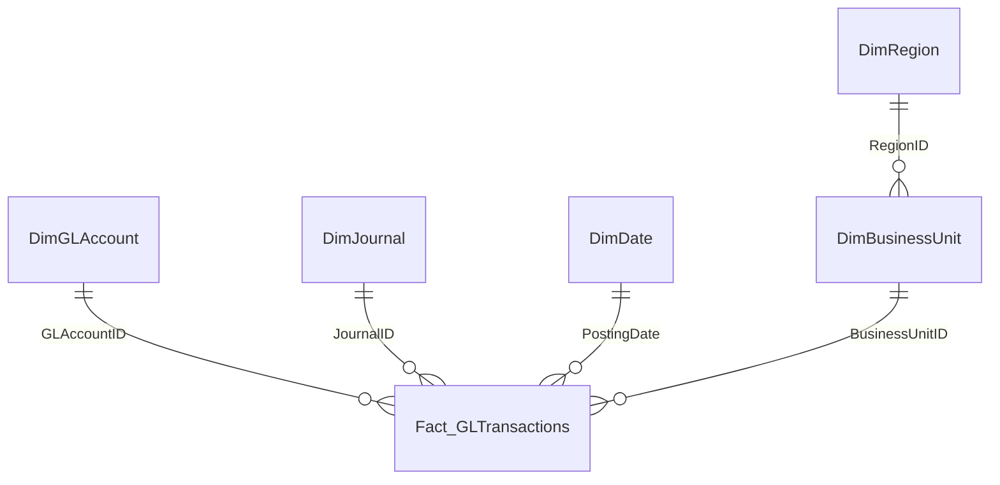
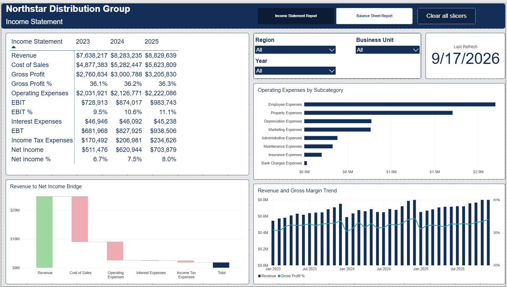
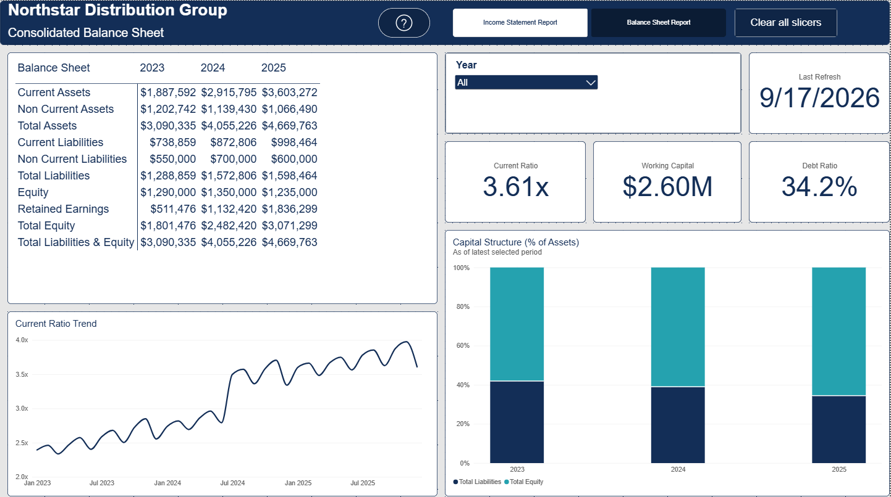
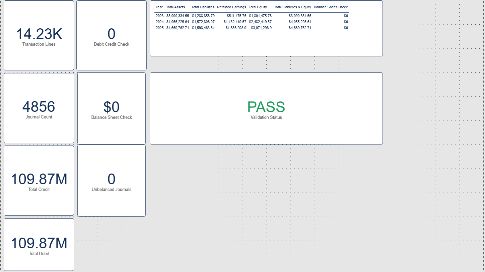
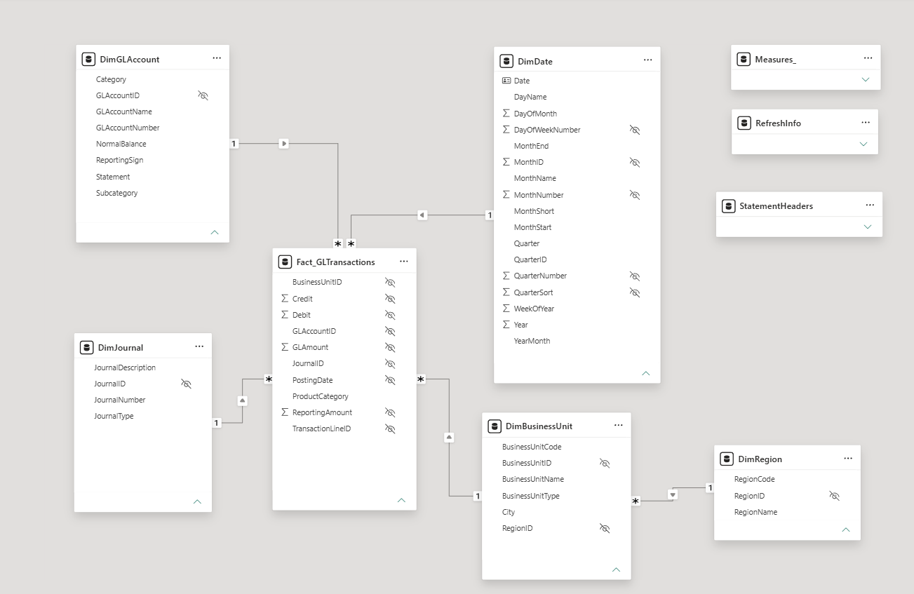
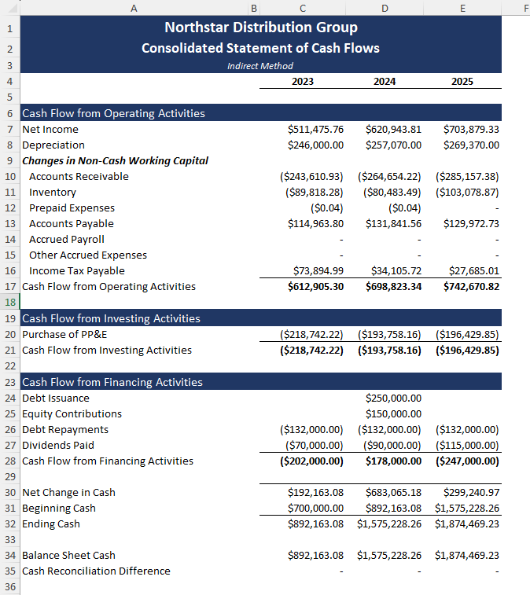

# Reporte y Análisis de Estados Financieros

[English](README.md) | **Español**

## Descripción general

Este proyecto es una simulación independiente de reporting financiero para **Northstar Distribution Group**, una empresa ficticia de distribución. Demuestra cómo transformar transacciones del libro mayor a nivel de detalle en un modelo centralizado que permite preparar un Estado de Resultados y un Balance General en Power BI, además de un Estado de Flujos de Efectivo por el método indirecto en Excel.

La solución combina lógica contable, transformación de datos, modelado dimensional, DAX, presentación de estados financieros y controles de conciliación. Todos los datos financieros son sintéticos y fueron creados específicamente para este proyecto de portafolio.

## Problema de negocio

En la simulación, el equipo de Finanzas depende de reportes preparados manualmente a partir de transacciones del libro mayor. Aunque los datos contables están disponibles, se requiere trabajo manual considerable para clasificar cuentas, calcular subtotales financieros, preparar saldos al cierre y conciliar los tres estados financieros.

El objetivo fue crear un entorno de reporting reutilizable que:

- Transforme la actividad del libro mayor en estados financieros estructurados.
- Produzca un Estado de Resultados y un Balance General interactivos en Power BI.
- Utilice el mismo modelo semántico de Power BI para preparar un Estado de Flujos de Efectivo indirecto en Excel.
- Permita analizar resultados por año, región y unidad de negocio cuando corresponda.
- Valide la contabilidad por partida doble y concilie los estados financieros.

## Arquitectura de la solución



El proyecto utiliza archivos fuente de Excel. Power Query importa y prepara los datos, crea la tabla de hechos y las dimensiones y carga el modelo final en Power BI.

## Datos fuente

El dataset sintético cubre el período del **1 de enero de 2023 al 31 de diciembre de 2025** y sigue el principio de partida doble.

| Métrica | Valor |
|---|---:|
| Líneas de transacción | 14,232 |
| Asientos contables | 4,856 |
| Cuentas contables | 29 |
| Unidades de negocio | 5 |
| Regiones | 3 |
| Total de débitos | $109,868,014.13 |
| Total de créditos | $109,868,014.13 |
| Asientos descuadrados | 0 |

La estructura organizacional representada en los datos es:

- **Regiones:** Central Operations, Southern Operations y Western Operations.
- **Unidades de negocio:** Head Office, Managua Distribution Center, León Distribution Center, Masaya Distribution Center y Granada Distribution Center.

Cada fila representa una línea de un asiento contable e incluye el asiento, la fecha de contabilización, la cuenta GL, la unidad de negocio, la región, el débito, el crédito y las clasificaciones necesarias para el reporting financiero.

Dos campos de importe cumplen funciones diferentes:

- `GLAmount = Debit - Credit` conserva el signo contable.
- `ReportingAmount = GLAmount × ReportingSign` presenta cada cuenta con el signo apropiado para los estados financieros.

El libro fuente también contiene el plan de cuentas, los mapeos de unidades de negocio y regiones, la estructura de los estados financieros y los controles de validación.

## Flujo de trabajo en Power Query

Power Query se utilizó para:

1. Importar desde Excel las tablas `stg_GLTransactions` y `StatementHeaders`.
2. Asignar los tipos de datos requeridos.
3. Mantener la consulta de staging como capa central de transformación y deshabilitar su carga al modelo.
4. Crear las consultas de hechos y dimensiones mediante referencias a la consulta de staging.
5. Seleccionar las columnas necesarias y eliminar duplicados de las tablas dimensionales.
6. Crear la dimensión de fechas y sus atributos de período.
7. Cargar las tablas de reporting en el modelo semántico de Power BI.

## Modelo de datos

El modelo utiliza una estructura de hechos y dimensiones, con una pequeña extensión tipo snowflake entre Región y Unidad de Negocio.



Tablas principales del modelo:

- `Fact_GLTransactions`
- `DimGLAccount`
- `DimJournal`
- `DimDate`
- `DimBusinessUnit`
- `DimRegion`
- `StatementHeaders`
- `RefreshInfo`
- Tabla de medidas

`StatementHeaders` es una tabla de layout desconectada. Controla el orden de las líneas, el tipo de cálculo, el comportamiento de los subtotales y el formato de visualización sin filtrar directamente el libro mayor.

## Lógica de reporting financiero

### Estado de Resultados

El Estado de Resultados utiliza la actividad del período seleccionado y una estructura dinámica. Las medidas DAX devuelven categorías contables, subtotales o porcentajes según la línea seleccionada.

El reporte incluye:

- Ingresos
- Costo de Ventas
- Utilidad Bruta y Margen Bruto
- Gastos Operativos
- EBIT y Margen Operativo
- Gastos por Intereses
- Utilidad Antes de Impuestos
- Gasto por Impuesto sobre la Renta
- Utilidad Neta y Margen Neto
- Análisis de gastos operativos por categoría
- Tendencia de ingresos y margen bruto
- Gráfico waterfall del Estado de Resultados

El Estado de Resultados puede analizarse por año, región y unidad de negocio.

### Balance General

El Balance General utiliza saldos acumulados hasta la fecha de reporte seleccionada. Las Utilidades Retenidas se calculan a partir de la Utilidad Neta acumulada y se combinan con el capital aportado.

El reporte incluye:

- Activos Corrientes y No Corrientes
- Activos Totales
- Pasivos Corrientes y No Corrientes
- Pasivos Totales
- Patrimonio y Utilidades Retenidas
- Patrimonio Total
- Pasivos Totales y Patrimonio
- Razón Corriente
- Capital de Trabajo
- Razón de Endeudamiento
- Tendencias de liquidez y estructura de capital

El Balance General se presenta de forma consolidada porque un mismo asiento puede contener líneas asignadas a diferentes unidades de negocio.

### Estado de Flujos de Efectivo

El Estado de Flujos de Efectivo por el método indirecto se construyó en Excel mediante **Analyze in Excel** y fórmulas CUBE conectadas al modelo semántico de Power BI.

- `CUBEMEMBER` define miembros del modelo, como los años de reporte y las medidas.
- `CUBEVALUE` recupera la Utilidad Neta, saldos de cuentas, depreciación y actividades de financiamiento.
- El flujo de operación comienza con la Utilidad Neta y se ajusta por depreciación y cambios en el capital de trabajo no monetario.
- El flujo de inversión registra las compras de propiedad, planta y equipo.
- El flujo de financiamiento registra emisiones de deuda, aportes de capital, pagos de deuda y dividendos.

La conciliación final confirma que:

```text
Efectivo inicial + Cambio neto en efectivo = Efectivo final
Efectivo final = Efectivo del Balance General
```

## Medidas principales

El modelo semántico incluye medidas para:

- GL Amount y Reporting Amount
- Ingresos y Costo de Ventas
- Utilidad Bruta y Margen Bruto
- Gastos Operativos
- EBIT y Margen Operativo
- EBT, Impuesto sobre la Renta y Utilidad Neta
- Saldo Acumulado
- Utilidades Retenidas
- Activos, Pasivos y Patrimonio Totales
- Razón Corriente, Capital de Trabajo y Razón de Endeudamiento
- Valores dinámicos del Estado de Resultados y Balance General
- Validaciones de débitos y créditos y del Balance General
- Información de transacciones, asientos y última actualización

### DAX representativo

Las siguientes medidas muestran la lógica central del reporting. `Reporting Amount` aplica el signo de presentación definido en el plan de cuentas; `Cumulative Balance` convierte la actividad del Balance General en un saldo a una fecha determinada; y `Retained Earnings` acumula la Utilidad Neta hasta la fecha seleccionada.

```DAX
Reporting Amount =
SUM(Fact_GLTransactions[ReportingAmount])

Cumulative Balance =
VAR AsOfDate =
    MAX(DimDate[Date])
RETURN
    CALCULATE(
        [Reporting Amount],
        DimGLAccount[Statement] = "Balance Sheet",
        FILTER(
            ALL(DimDate),
            DimDate[Date] <= AsOfDate
        )
    )

Retained Earnings =
VAR AsOfDate =
    MAX(DimDate[Date])
RETURN
    CALCULATE(
        [Net Income],
        FILTER(
            ALL(DimDate),
            DimDate[Date] <= AsOfDate
        )
    )
```

Las dos medidas dinámicas de los estados financieros utilizan `StatementHeaders[MeasureType]` para escoger el cálculo correcto de cada línea presentada.

```DAX
Income Statement Value =
VAR SelectedType =
    SELECTEDVALUE(StatementHeaders[MeasureType])
RETURN
    SWITCH(
        SelectedType,
        1, [Current Amount],
        2, [Income Statement Subtotal],
        3, [Income Statement Percentage],
        BLANK()
    )

Balance Sheet Value =
VAR SelectedType =
    SELECTEDVALUE(StatementHeaders[MeasureType])
RETURN
    SWITCH(
        SelectedType,
        4, [Balance Sheet Current Balance],
        5, [Balance Sheet Section Subtotal],
        6, [Retained Earnings],
        7, [Total Equity],
        8, [Total Liabilities & Equity],
        BLANK()
    )
```

Finalmente, las medidas de validación comprueban tanto la ecuación contable como los controles a nivel de asiento.

```DAX
Balance Sheet Check =
[Total Assets] - [Total Liabilities & Equity]

Validation Status =
VAR DebitCreditOK =
    ABS([Debit Credit Check]) < 0.01
VAR BalanceSheetOK =
    ABS([Balance Sheet Check]) < 0.01
VAR JournalsOK =
    [Unbalanced Journals] = 0
RETURN
    IF(
        DebitCreditOK && BalanceSheetOK && JournalsOK,
        "PASS",
        "REVIEW"
    )
```

## Validación y conciliación

La integridad financiera se trató como un resultado obligatorio del proyecto y no solamente como una verificación visual.

| Control de validación | Resultado |
|---|---:|
| Total débitos menos total créditos | $0.00 |
| Asientos descuadrados | 0 |
| Cuentas sin mapeo | 0 |
| Unidades de negocio sin mapeo | 0 |
| Activos menos pasivos y patrimonio | $0.00 |
| Efectivo final menos efectivo del Balance General | $0.00 |
| Estado final de validación | PASS |

## Resultados financieros

| Métrica | 2023 | 2024 | 2025 |
|---|---:|---:|---:|
| Ingresos | $7,638,217 | $8,283,235 | $8,829,639 |
| Utilidad Bruta | $2,760,834 | $3,000,788 | $3,205,830 |
| Margen Bruto | 36.1% | 36.2% | 36.3% |
| EBIT | $728,913 | $874,017 | $983,743 |
| Margen Operativo | 9.5% | 10.6% | 11.1% |
| Utilidad Neta | $511,476 | $620,944 | $703,879 |
| Margen Neto | 6.7% | 7.5% | 8.0% |
| Flujo de Efectivo Operativo | $612,905 | $698,823 | $742,671 |
| Efectivo Final | $892,163 | $1,575,228 | $1,874,469 |
| Activos Totales | $3,090,335 | $4,055,226 | $4,669,763 |

## Hallazgos financieros

- Los ingresos aumentaron de $7.64 millones en 2023 a $8.83 millones en 2025, equivalente a una tasa de crecimiento anual compuesta aproximada de 7.5%.
- El Margen Bruto se mantuvo estable y mejoró ligeramente de 36.1% a 36.3%.
- El EBIT creció más rápido que los ingresos y el Margen Operativo aumentó de 9.5% a 11.1%, lo que indica una mejora del apalancamiento operativo dentro de la simulación.
- La Utilidad Neta aumentó de $511 mil a $704 mil, mientras que el Margen Neto mejoró de 6.7% a 8.0%.
- La Razón Corriente aumentó de 2.55x a 3.61x y el Capital de Trabajo creció de $1.15 millones a $2.60 millones.
- La Razón de Endeudamiento disminuyó de 41.7% a 34.2% porque el patrimonio creció más rápido que los pasivos.
- El Flujo de Efectivo Operativo fue positivo en todos los años y superó la Utilidad Neta.
- Las compras anuales de PP&E fueron inferiores a la depreciación durante los tres años, lo que contribuyó a que los Activos No Corrientes netos disminuyeran de $1.20 millones a $1.07 millones.
- El Efectivo Final aumentó a $1.87 millones y concilió completamente con el Balance General.

## Reportes de Power BI

### Estado de Resultados



### Balance General



### Validación de datos



### Modelo de datos



### Estado de Flujos de Efectivo



## Herramientas utilizadas

- Microsoft Excel
- Power Query
- Power BI
- DAX
- Modelo semántico de Power BI
- Analyze in Excel
- Fórmulas CUBEMEMBER y CUBEVALUE

## Estructura del repositorio

```text
financial-statements-bi-reporting/
├── README.md
├── README.es.md
├── data/
│   ├── Northstar_FinanceDW_Source.xlsx
│   └── Northstar_Statement_Headers.xlsx
├── powerbi/
│   └── Northstar Financial Statements Reporting & Analysis.pbix
├── excel/
│   └── Northstar Financial Statements Reporting & Analysis.xlsx
├── docs/
│   └── Business Case.docx
└── images/
    ├── 01_data_model.png
    ├── 02_income_statement.png
    ├── 03_balance_sheet.png
    ├── 04_data_validation.png
    └── 05_cash_flow_statement.png
```

## Notas de actualización

- Es posible que la ruta de origen de Power BI deba actualizarse después de descargar el proyecto.
- El archivo de Flujo de Efectivo en Excel utiliza una conexión al modelo semántico de Power BI. La actualización en vivo de las fórmulas CUBE requiere permiso de acceso al modelo publicado.
- El libro guardado conserva los resultados calculados para su revisión, pero otro usuario no podrá actualizar la conexión sin los permisos requeridos.

## Habilidades demostradas

- Modelado de estados financieros
- Análisis del libro mayor y contabilidad por partida doble
- Staging y transformación en Power Query
- Modelado dimensional de datos
- DAX y manejo del contexto de filtro
- Estructuras dinámicas para estados financieros
- Cálculos acumulados para el Balance General
- Preparación del Flujo de Efectivo indirecto
- Fórmulas CUBE y conexión al modelo semántico
- Ratios financieros y análisis de desempeño
- Conciliación contable y controles de calidad de datos
- Reporting gerencial y diseño de dashboards

## Notas del proyecto

Northstar Distribution Group y todas sus transacciones son ficticias. Este proyecto es una simulación independiente de portafolio y no representa trabajo realizado para una empresa real. No contiene datasets propietarios de cursos ni información de compañías reales.

## Autor

**Christian Castillo**  
[Perfil de GitHub](https://github.com/christiancastillo301203)
