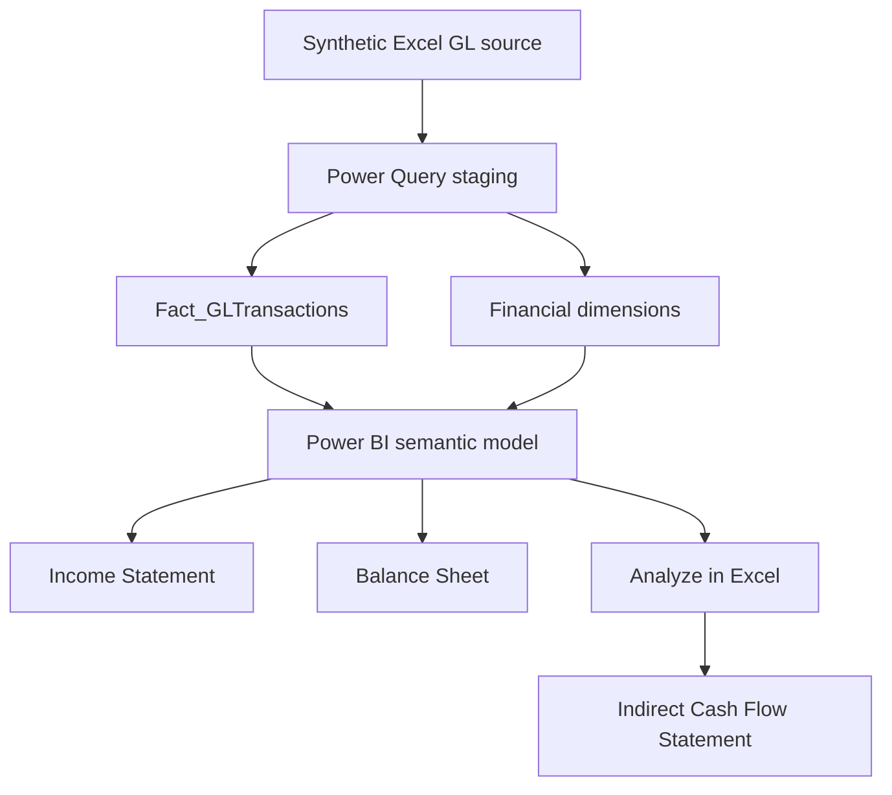
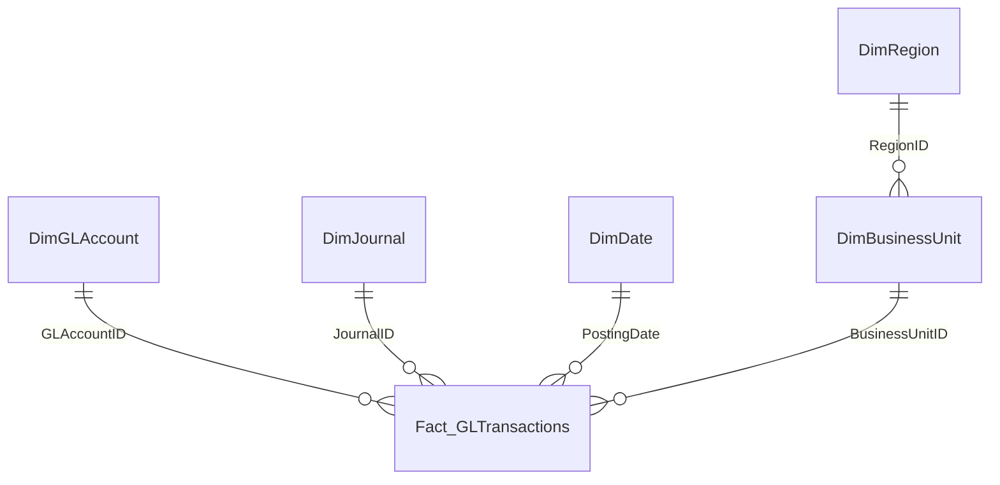

# Financial Statements Reporting and Analysis

**English** | [Español](README.es.md)

## Overview

This project is an independent financial reporting simulation for **Northstar Distribution Group**, a fictional distribution company. It demonstrates how transaction-level general ledger data can be transformed into a centralized reporting model that supports an Income Statement and Balance Sheet in Power BI and an indirect Cash Flow Statement in Excel.

The solution combines accounting logic, data transformation, dimensional modeling, DAX, financial statement presentation, and reconciliation controls. All financial data is synthetic and was created specifically for this portfolio project.

## Business Problem

The simulated Finance team relies on manually prepared reports based on general ledger transactions. Although the accounting data is available, substantial manual work is required to classify accounts, calculate financial subtotals, prepare period-end balances, and reconcile the three financial statements.

The objective was to create a reusable reporting environment that:

- Transforms general ledger activity into structured financial statements.
- Produces an interactive Income Statement and Balance Sheet in Power BI.
- Uses the same Power BI semantic model to prepare an indirect Cash Flow Statement in Excel.
- Supports analysis by year, region, and business unit where appropriate.
- Validates double-entry accounting and reconciles the financial statements.

## Solution Architecture



The project uses Excel-based source files. Power Query imports and prepares the source data, creates the fact and dimension tables, and loads the final model into Power BI.

## Source Data

The synthetic dataset covers **January 1, 2023 through December 31, 2025** and follows double-entry accounting.

| Metric | Value |
|---|---:|
| Transaction lines | 14,232 |
| Journal entries | 4,856 |
| GL accounts | 29 |
| Business units | 5 |
| Regions | 3 |
| Total debits | $109,868,014.13 |
| Total credits | $109,868,014.13 |
| Unbalanced journals | 0 |

The organizational structure represented in the dataset is:

- **Regions:** Central Operations, Southern Operations, and Western Operations.
- **Business units:** Head Office, Managua Distribution Center, León Distribution Center, Masaya Distribution Center, and Granada Distribution Center.

Each row represents one journal-entry line and includes the journal, posting date, GL account, business unit, region, debit, credit, and financial reporting classifications.

Two amount fields support different purposes:

- `GLAmount = Debit - Credit` preserves the accounting sign.
- `ReportingAmount = GLAmount × ReportingSign` presents accounts using the appropriate financial reporting sign.

The source workbook also contains the Chart of Accounts, business-unit mapping, region mapping, statement layout, and validation controls.

## Power Query Workflow

Power Query was used to:

1. Import the `stg_GLTransactions` and `StatementHeaders` tables from Excel.
2. Assign the required data types.
3. Keep the staging query as the central transformation layer and disable its model load.
4. Create the fact and dimension queries by referencing the staging query.
5. Select the required columns and remove duplicates from dimension tables.
6. Create the Date dimension and period attributes.
7. Load the reporting tables into the Power BI semantic model.

## Data Model

The model uses a fact-and-dimension structure with a small snowflake extension between Region and Business Unit.



Main model tables:

- `Fact_GLTransactions`
- `DimGLAccount`
- `DimJournal`
- `DimDate`
- `DimBusinessUnit`
- `DimRegion`
- `StatementHeaders`
- `RefreshInfo`
- Measures table

`StatementHeaders` is a disconnected layout table. It controls statement order, line type, subtotal behavior, and display format without filtering the general ledger directly.

## Financial Reporting Logic

### Income Statement

The Income Statement uses current-period activity and a dynamic statement layout. DAX measures return account categories, subtotals, or percentages depending on the selected statement line.

The report includes:

- Revenue
- Cost of Sales
- Gross Profit and Gross Margin
- Operating Expenses
- EBIT and Operating Margin
- Interest Expense
- Earnings Before Tax
- Income Tax Expense
- Net Income and Net Margin
- Operating-expense analysis by category
- Revenue and Gross Margin trend
- Income Statement waterfall

The Income Statement can be analyzed by year, region, and business unit.

### Balance Sheet

The Balance Sheet uses cumulative account balances through the selected reporting date. Retained Earnings is calculated from cumulative Net Income and combined with contributed equity.

The report includes:

- Current and Non-Current Assets
- Total Assets
- Current and Non-Current Liabilities
- Total Liabilities
- Equity and Retained Earnings
- Total Equity
- Total Liabilities and Equity
- Current Ratio
- Working Capital
- Debt Ratio
- Liquidity and capital-structure trends

The Balance Sheet is presented on a consolidated basis because individual journal entries may contain lines assigned to different business units.

### Cash Flow Statement

The indirect Cash Flow Statement was built in Excel using **Analyze in Excel** and CUBE formulas connected to the Power BI semantic model.

- `CUBEMEMBER` defines model members such as reporting years and measures.
- `CUBEVALUE` retrieves Net Income, account balances, depreciation, and financing activity.
- Operating cash flow starts with Net Income and adjusts for depreciation and changes in non-cash working capital.
- Investing cash flow captures purchases of property, plant, and equipment.
- Financing cash flow captures debt issuance, equity contributions, debt repayments, and dividends.

The final reconciliation confirms:

```text
Beginning Cash + Net Change in Cash = Ending Cash
Ending Cash = Balance Sheet Cash
```

## Key Measures

The semantic model includes measures for:

- GL Amount and Reporting Amount
- Revenue and Cost of Sales
- Gross Profit and Gross Margin
- Operating Expenses
- EBIT and Operating Margin
- EBT, Income Tax, and Net Income
- Cumulative Balance
- Retained Earnings
- Total Assets, Liabilities, and Equity
- Current Ratio, Working Capital, and Debt Ratio
- Dynamic Income Statement and Balance Sheet values
- Debit-credit and Balance Sheet validation
- Transaction, journal, and refresh information

### Representative DAX

The following measures illustrate the core reporting logic. `Reporting Amount` applies the presentation sign defined in the Chart of Accounts; `Cumulative Balance` converts Balance Sheet activity into an as-of balance; and `Retained Earnings` accumulates Net Income through the selected date.

```DAX
Reporting Amount =
SUM(Fact_GLTransactions[ReportingAmount])

Cumulative Balance =
VAR AsOfDate =
    MAX(DimDate[Date])
RETURN
    CALCULATE(
        [Reporting Amount],
        DimGLAccount[Statement] = "Balance Sheet",
        FILTER(
            ALL(DimDate),
            DimDate[Date] <= AsOfDate
        )
    )

Retained Earnings =
VAR AsOfDate =
    MAX(DimDate[Date])
RETURN
    CALCULATE(
        [Net Income],
        FILTER(
            ALL(DimDate),
            DimDate[Date] <= AsOfDate
        )
    )
```

The two dynamic statement measures use `StatementHeaders[MeasureType]` to select the correct calculation for each displayed row.

```DAX
Income Statement Value =
VAR SelectedType =
    SELECTEDVALUE(StatementHeaders[MeasureType])
RETURN
    SWITCH(
        SelectedType,
        1, [Current Amount],
        2, [Income Statement Subtotal],
        3, [Income Statement Percentage],
        BLANK()
    )

Balance Sheet Value =
VAR SelectedType =
    SELECTEDVALUE(StatementHeaders[MeasureType])
RETURN
    SWITCH(
        SelectedType,
        4, [Balance Sheet Current Balance],
        5, [Balance Sheet Section Subtotal],
        6, [Retained Earnings],
        7, [Total Equity],
        8, [Total Liabilities & Equity],
        BLANK()
    )
```

Finally, the validation measures test both the accounting equation and the journal-level controls.

```DAX
Balance Sheet Check =
[Total Assets] - [Total Liabilities & Equity]

Validation Status =
VAR DebitCreditOK =
    ABS([Debit Credit Check]) < 0.01
VAR BalanceSheetOK =
    ABS([Balance Sheet Check]) < 0.01
VAR JournalsOK =
    [Unbalanced Journals] = 0
RETURN
    IF(
        DebitCreditOK && BalanceSheetOK && JournalsOK,
        "PASS",
        "REVIEW"
    )
```

## Validation and Reconciliation

Financial integrity was treated as a required output rather than a visual-only check.

| Validation control | Result |
|---|---:|
| Total debits minus total credits | $0.00 |
| Unbalanced journals | 0 |
| Missing account mappings | 0 |
| Missing business-unit mappings | 0 |
| Assets minus liabilities and equity | $0.00 |
| Ending Cash minus Balance Sheet Cash | $0.00 |
| Final validation status | PASS |

## Financial Results

| Metric | 2023 | 2024 | 2025 |
|---|---:|---:|---:|
| Revenue | $7,638,217 | $8,283,235 | $8,829,639 |
| Gross Profit | $2,760,834 | $3,000,788 | $3,205,830 |
| Gross Margin | 36.1% | 36.2% | 36.3% |
| EBIT | $728,913 | $874,017 | $983,743 |
| Operating Margin | 9.5% | 10.6% | 11.1% |
| Net Income | $511,476 | $620,944 | $703,879 |
| Net Margin | 6.7% | 7.5% | 8.0% |
| Operating Cash Flow | $612,905 | $698,823 | $742,671 |
| Ending Cash | $892,163 | $1,575,228 | $1,874,469 |
| Total Assets | $3,090,335 | $4,055,226 | $4,669,763 |

## Financial Insights

- Revenue increased from $7.64 million in 2023 to $8.83 million in 2025, representing a two-year compound annual growth rate of approximately 7.5%.
- Gross Margin remained stable and improved slightly from 36.1% to 36.3%.
- EBIT grew faster than revenue and Operating Margin increased from 9.5% to 11.1%, indicating improved operating leverage in the simulation.
- Net Income increased from $511 thousand to $704 thousand, while Net Margin improved from 6.7% to 8.0%.
- The Current Ratio increased from 2.55x to 3.61x and Working Capital increased from $1.15 million to $2.60 million.
- The Debt Ratio declined from 41.7% to 34.2% as equity grew faster than liabilities.
- Operating Cash Flow remained positive in every year and exceeded Net Income.
- Annual PP&E purchases were below depreciation in all three years, contributing to the decline in net Non-Current Assets from $1.20 million to $1.07 million.
- Ending Cash increased to $1.87 million and reconciled fully to the Balance Sheet.

## Power BI Reports

### Income Statement Report


### Balance Sheet Report


### Data Validation


### Data Model


### Cash Flow Statement


## Tools Used

- Microsoft Excel
- Power Query
- Power BI
- DAX
- Power BI semantic model
- Analyze in Excel
- CUBEMEMBER and CUBEVALUE formulas

## Repository Structure

```text
financial-statements-bi-reporting/
├── README.md
├── README.es.md
├── data/
│   ├── Northstar_FinanceDW_Source.xlsx
│   └── Northstar_Statement_Headers.xlsx
├── powerbi/
│   └── Northstar Financial Statements Reporting & Analysis.pbix
├── excel/
│   └── Northstar Financial Statements Reporting & Analysis.xlsx
├── docs/
│   └── Business Case.docx
└── images/
    ├── 01_data_model.png
    ├── 02_income_statement.png
    ├── 03_balance_sheet.png
    ├── 04_data_validation.png
    └── 05_cash_flow_statement.png
```

## Refresh Notes

- The Power BI source path may need to be updated after downloading the project.
- The Excel Cash Flow workbook uses a connection to the Power BI semantic model. Live CUBE-formula refresh requires permission to access the published model.
- The saved workbook contains the calculated output for review, but another user cannot refresh the model connection without the required access.

## Skills Demonstrated

- Financial statement modeling
- General ledger and double-entry accounting analysis
- Power Query staging and transformation
- Dimensional data modeling
- DAX and filter-context management
- Dynamic financial statement layouts
- Cumulative Balance Sheet calculations
- Indirect cash flow preparation
- CUBE formulas and semantic-model connectivity
- Financial ratios and performance analysis
- Accounting reconciliation and data-quality controls
- Management reporting and dashboard design

## Project Notes

Northstar Distribution Group and all underlying transactions are fictional. This project is an independent portfolio simulation and does not represent work completed for an actual company. No proprietary course datasets or company information are included.

## Author

**Christian Castillo**  
[GitHub Profile](https://github.com/christiancastillo301203)
